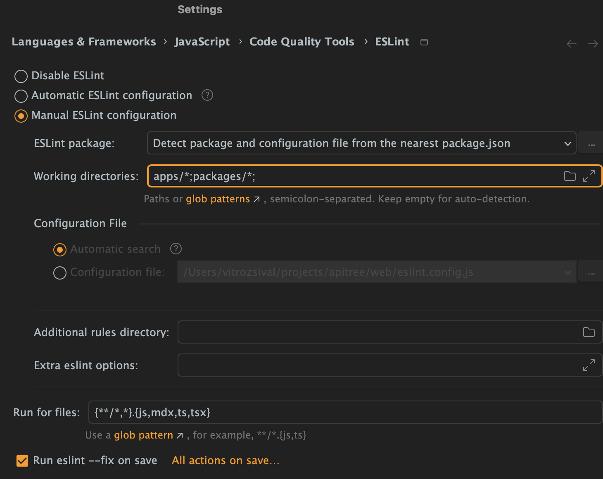

<div align="center">

<a href="https://github.com/ApiTreeCZ">

</a>

# ESLint Config

[](https://www.npmjs.com/package/@apitree.cz/eslint-config)

### [ESLint](https://eslint.org) configuration for ApiTree projects

</div>

## Installation

```bash
pnpm add --save-dev @apitree.cz/eslint-config eslint
```

### Monorepos

Prior to the installation, add the following to your repository root `.npmrc`:

```
public-hoist-pattern[]=*eslint*
```

Install and use the package in the root only.

## Usage

Use one of the following configurations in your repository's root `eslint.config.js` file.

### Base

Suitable for general TypeScript projects.

```javascript
export { base as default } from '@apitree.cz/eslint-config';
```

### React

Necessary for React (JSX/MDX) projects.

```javascript
import { base, react } from '@apitree.cz/eslint-config';
import { defineConfig } from 'eslint/config';

export default defineConfig(base, react);
```

### Next.js

Next.js configuration requires to specify the path to the app(s).

```javascript
import { base, react, nextjs } from '@apitree.cz/eslint-config';
import { defineConfig } from 'eslint/config';

export default defineConfig(base, react, nextjs(['apps/<nextjs-app>']));
```

> Omit the apps array if you have a single Next.js app repository (no monorepo).

### Nest.js

Nest.js configuration requires to specify the path to the app(s).

```javascript
import { base, nestjs } from '@apitree.cz/eslint-config';
import { defineConfig } from 'eslint/config';

export default defineConfig(base, nestjs(['apps/<nestjs-app>']));
```

> Omit the apps array if you have a single Nest.js app repository (no monorepo).

### Storybook

Necessary for projects containing Storybook instance.

```javascript
import { base, react, storybook } from '@apitree.cz/eslint-config';
import { defineConfig } from 'eslint/config';

export default defineConfig(base, react, storybook);
```

## IntelliJ IDE Setup

Following IntelliJ IDEs setup is recommended for the best developer experience:



### Recommended Values

#### Run for files

```
{**/*,*}.{js,mdx,ts,tsx}
```
