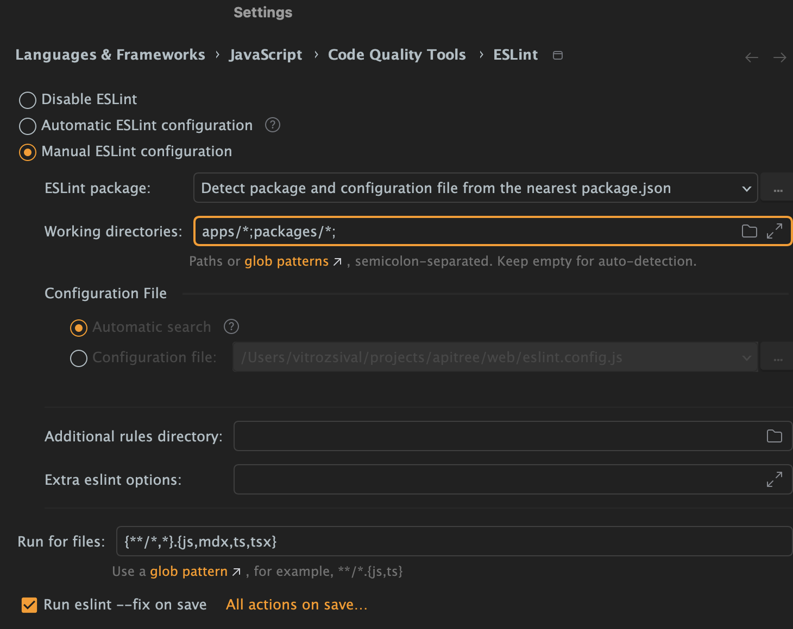

<div align="center">

<a href="https://github.com/ApiTreeCZ">

</a>

# ESLint Config

[](https://www.npmjs.com/package/@apitree.cz/eslint-config)

### [ESLint](https://eslint.org) configuration for ApiTree projects

</div>

## Installation

```bash
pnpm add --save-dev @apitree.cz/eslint-config eslint
```

### Monorepos

Install and use the package in the root only.

## Usage

Use the base configuration in your repository's root `eslint.config.js` file.

### Base

Suitable for general TypeScript projects.

```javascript
export { base as default } from '@apitree.cz/eslint-config';
```

### Presets

For project-specific rules, install one of the scoped preset packages. **Note that these presets must be used in conjunction with the base `@apitree.cz/eslint-config` package.**

- [React Preset](file:///Users/vitrozsival/projects/apitree/toolbox/packages/eslint-config-react/README.md) (`@apitree.cz/eslint-config-react`)
- [Next.js Preset](file:///Users/vitrozsival/projects/apitree/toolbox/packages/eslint-config-nextjs/README.md) (`@apitree.cz/eslint-config-nextjs`)
- [NestJS Preset](file:///Users/vitrozsival/projects/apitree/toolbox/packages/eslint-config-nestjs/README.md) (`@apitree.cz/eslint-config-nestjs`)
- [Storybook Preset](file:///Users/vitrozsival/projects/apitree/toolbox/packages/eslint-config-storybook/README.md) (`@apitree.cz/eslint-config-storybook`)

## IntelliJ IDE Setup

Following IntelliJ IDEs setup is recommended for the best developer experience:



### Recommended Values

#### ✅ Automatic ESLint configuration

#### Run for files

```
{**/*,*}.{js,mdx,ts,tsx}
```

#### ✅ Run eslint --fix on save
