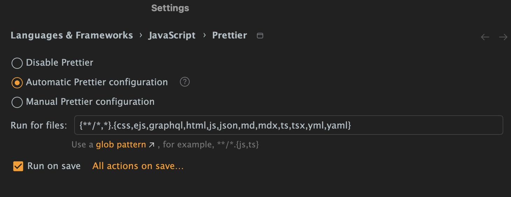

<div align="center">

<a href="https://github.com/ApiTreeCZ">

</a>

# Prettier Config

[](https://www.npmjs.com/package/@apitree.cz/prettier-config)

### [Prettier](https://prettier.io) configuration for ApiTree projects

</div>

## Installation

```bash
pnpm add --save-dev @apitree.cz/prettier-config prettier
```

### PNPM Monorepos

Prior to the installation, add the following to your repository root `pnpm-workspace.yaml`:

```yaml
publicHoistPattern:
  - '*prettier*'
```

Install and use the package in the root only.

## Usage

Add the following configuration to your `prettier.config.js`:

```javascript
export { config as default } from '@apitree.cz/prettier-config';
```

## IntelliJ IDE Setup

Following IntelliJ IDEs setup is recommended for the best developer experience:



### Recommended Values

#### ✅ Automatic Prettier configuration

#### Run for files

```
{**/*,*}.{css,ejs,graphql,html,js,json,md,mdx,ts,tsx,yml,yaml}
```

#### ✅ Run on save
